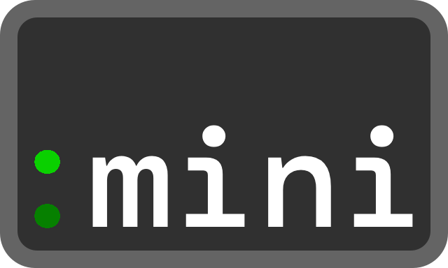

# Less-Pager-Mini

<div align="center">
  <a href="https://github.com/dawsonhuang0/Less-Pager-Mini">
    
  </a>

  <br />

  <p align="center">
    A lightweight terminal pager inspired by <code><a href="https://github.com/gwsw/less">less</a></code>, written in TypeScript for Node.js CLI apps.  
  </p>

  [](https://www.npmjs.com/package/less-pager-mini)
  [](https://www.npmjs.com/package/less-pager-mini)
  
  [](https://github.com/dawsonhuang0/Less-Pager-Mini/actions)
</div>

<details>
  <summary>Table of Contents</summary>
  <ol>
    <li>
      <a href="#getting-started">Getting Started</a>
      <ul>
        <li><a href="#prerequisites">Prerequisites</a></li>
        <li><a href="#installation">Installation</a></li>
      </ul>
    </li>
    <li>
      <a href="#usage">Usage</a>
      <ul>
        <li><a href="#function-parameters">Parameters</a></li>
      </ul>
    </li>
    <li>
      <a href="#about-the-project">About The Project</a>
      <ul>
        <li><a href="#roadmap">Roadmap</a></li>
        <li><a href="#built-with">Built With</a></li>
      </ul>
    </li>
    <li><a href="#feedback">Feedback</a></li>
    <li><a href="#contributing">Contributing</a></li>
    <li><a href="#acknowledgments">Acknowledgments</a></li>
    <li><a href="#license">License</a></li>
  </ol>
</details>


## Getting Started

Follow these simple steps to install Less-Pager-Mini.

### Prerequisites

Make sure you have the following installed:

- [Node.js](https://nodejs.org/) (v16 or higher)
- [npm](https://www.npmjs.com/) (comes with Node.js)

### Installation

Install Less-Pager-Mini via npm:

```bash
npm i less-pager-mini
```


## Usage

<h3>JavaScript / TypeScript:</h3>

```ts
import { pager } from 'less-pager-mini';

const example = ['a', 'b', 'c'];
await pager(example);
```

### Function Parameters:

<code>input</code>: Any unknown input (except <code>symbol</code>) to page.

<code>preserveFormat</code>: If <code>true</code>, preserves JavaScript default formatting.

```bash
Format preserved:
["a","b",["c","d"]]
{"a":1,"b":2,"c":{"d":3}}

Formatted:
[
  "a",
  "b",
  [
    "c",
    "d"
  ]
]
{
  "a": 1,
  "b": 2,
  "c": {
    "d": 3
  }
}
```

<code>examineFile</code>: if <code>true</code>, attempts to treat input as file path(s) and page content, invalid files will be ignored.

Example input:

```ts
'a.txt'
```

or

```ts
[
  'a.txt',
  'b.md',
  'c' // Ignored
]
```


## About The Project

Wanna glance at your array or objects, but scrolling through terminal feels painful? This tool got your back.  

**Less-Pager-Mini** is a lightweight pager that lets you scroll massive terminal output with ease and precision.  

Whether you're debugging, dumping logs, or previewing data structures — this pager helps you scroll fast without getting lost in overwhelming output.

- 🔁 **Familiar Commands** – Inherits command keys from [`less`](https://github.com/gwsw/less)
- 📦 **Minimal Dependencies** – Lightweight, stable, and portable
- 🖥️ **Pure Terminal UX** – Replicates 99% of the [`less`](https://github.com/gwsw/less) experience

## Roadmap

- [ ] COMMAND MODE
- [ ] MOVING
  - [x] Forward one line
  - [x] Backward one line
  - [x] Forward N line
  - [x] Backward N line
  - [x] Forward one window
  - [x] Backward one window
  - [x] Forward one window and set window to N
  - [x] Backward one window and set window to N
  - [x] Forward one window, but don't stop at EOF
  - [x] Forward one half-window and set half-window to N
  - [x] Backward one half-window and set half-window to N
  - [ ] Right one or N positions half screen width
  - [ ] Left one or N positions half screen width
- [ ] JUMPING
- [ ] SEARCHING
- [ ] CHANGING FILES
- [ ] MISCELLANEOUS COMMANDS
- [ ] OPTIONS
- [x] Support wide-character (emoji, CJK, etc.) rendering

## Built With

[](https://en.wikipedia.org/wiki/ANSI_escape_code)  
[](https://www.typescriptlang.org/)  
[](https://nodejs.org/)  
[](https://eslint.org/)  
[](https://vitest.dev/)  
[](https://typicode.github.io/husky/)


## Feedback

Found something odd or came up with a bright improvement?  
Feel free to [open an issue](https://github.com/dawsonhuang0/Less-Pager-Mini/issues) — contributions and feedback are always welcome!


## Contributing

Contributions are welcome! If you have suggestions, improvements, or bug fixes, feel free to:

- Fork the repo
- Create a new branch
- Make your changes
- Open a pull request

Please follow the coding style and write clear commit messages.  
Let’s make **Less-Pager-Mini** better together!


## Acknowledgments

- Inspired by <code><a href="https://github.com/gwsw/less">less</a></code> by Mark Nudelman – the legendary terminal pager that set the standard.


## License

Distributed under the MIT License.  
See [`LICENSE`](LICENSE) for more information.
