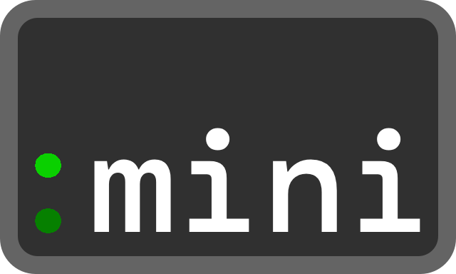

# Less-Pager-Mini

<div align="center">
  <a href="https://github.com/dawsonhuang0/Less-Pager-Mini">
    
  </a>

  <br />

  <p align="center">
    A lightweight terminal pager inspired by <code><a href="https://github.com/gwsw/less">less</a></code>, written in TypeScript for Node.js CLI apps.  
  </p>

  [](https://www.npmjs.com/package/less-pager-mini)
  [](https://www.npmjs.com/package/less-pager-mini)
  
  [](https://github.com/dawsonhuang0/Less-Pager-Mini/actions)
</div>

<details>
  <summary>Table of Contents</summary>
  <ol>
    <li>
      <a href="#getting-started">Getting Started</a>
      <ul>
        <li><a href="#prerequisites">Prerequisites</a></li>
        <li><a href="#installation">Installation</a></li>
      </ul>
    </li>
    <li>
      <a href="#usage">Usage</a>
      <ul>
        <li><a href="#function-parameters">Function Parameters</a></li>
        <li><a href="#featuring-arguments">Featuring Arguments</a></li>
        <li><a href="#notice">Notice</a></li>
      </ul>
    </li>
    <li>
      <a href="#about-the-project">About The Project</a>
      <ul>
        <li><a href="#roadmap">Roadmap</a></li>
        <li><a href="#built-with">Built With</a></li>
      </ul>
    </li>
    <li><a href="#feedback">Feedback</a></li>
    <li><a href="#contributing">Contributing</a></li>
    <li><a href="#acknowledgments">Acknowledgments</a></li>
    <li><a href="#license">License</a></li>
    <li><a href="#-famous-dependents">🏆 Famous Dependents</a></li>
  </ol>
</details>


## Getting Started

Follow these simple steps to install Less-Pager-Mini.

### Prerequisites

Make sure you have the following installed:

- [Node.js](https://nodejs.org/) (v18 or higher)
- [npm](https://www.npmjs.com/) (comes with Node.js)

### Installation

Install Less-Pager-Mini via npm:

```bash
npm i less-pager-mini
```

If you want to use it directly from your terminal:

```bash
npm i -g less-pager-mini
```


## Usage

<h3>Terminal:</h3>

Use `lmn` anywhere you'd use `less` — same keys, same flags:

```bash
lmn file.txt          # page a file
lmn -N app.log        # any less option works
cmd | lmn             # page piped output
lmn huge-500GB.log    # giant files open instantly
```

<h3>JavaScript / TypeScript:</h3>

```ts
import pager from 'less-pager-mini';

const example = ['a', 'b', 'c'];

await pager(example);
await pager(example, ['-N', '--chop-long-lines']);
await pager(example, ['-R'], { LESS: '-X' });
```

### Function Parameters

<code>input</code>: Any unknown input to page.

<code>args</code>: Less arguments as an array, spelled the way `less` documents
them — `['-N', '--chop-long-lines', '+G']`. They are scanned in order, so a
later one overrides an earlier one, and an option may repeat.

<code>env</code>: An environment overlay for this call — the variables `less`
consults (`LESS`, `LESSOPEN`, `LESSSECURE`, ...). `$LESS` is scanned before
`args`, as it is before `argv` on a command line.

### Featuring Arguments

You can use the following flags in `args`:

<code>--examine-file</code>: Treats the input as file path(s) and reads from disk, 
like naming them on the command line.

Example input:

```ts
'a.txt'
```

or

```ts
[
  'a.txt',
  'b.md',
  'c' // Ignored
]
```

<code>--tab-object</code>: JSON.stringifies the input object indented with `\t`. 
You can adjust tab stops using the `--tabs` option.

```json
off:
["a","b",["c","d"]]
{"a":1,"b":2,"c":{"d":3}}

on:
[
  "a",
  "b",
  [
    "c",
    "d"
  ]
]
{
  "a": 1,
  "b": 2,
  "c": {
    "d": 3
  }
}
```

<code>--use-gnu-regexp</code>:  uses GNU regular expressions for searching. On for glibc systems,
Off elsewhere by default - searching with POSIX regular expressions.

<code>--use-js-regexp</code>: Searches with JavaScript's `RegExp`. Off by default —
searching with POSIX or GNU regular expressions.

<code>--use-zsh-glob</code>: Expands a filename with zsh's globbing rules in process.
On for Windows, Off elsewhere by default — globbing via `$SHELL`.

<code>--lesskey-help</code>: Displays the syntax of lesskey files.

<code>--view-lesskey</code>: Shows the lesskeys in use — `v` edits and re-applies the one on screen;
creates `~/.lesskey` if it does not exist.

### Notice:
<code>--examine-file</code> and <code>--tab-object</code> are not supported in `lmn`.


## About The Project

Want to glance your array or objects, but scrolling through terminal feels painful? This tool got your back.  

**Less-Pager-Mini** is a lightweight pager that lets you scroll massive terminal output with ease and precision.  

Whether you're debugging, dumping logs, or previewing data structures — this pager helps you scroll fast without getting lost in overwhelming output.

- 🔁 **Familiar Commands** – Inherits command keys from [`less`](https://github.com/gwsw/less)
- 📦 **Zero Dependencies** – One bundled file, nothing else installed
- 🖥️ **Pure Terminal UX** – Replicates 99% of the [`less`](https://github.com/gwsw/less) experience


## Roadmap

- [x] COMMAND MODE
- [x] MOVING
- [x] SEARCHING
- [x] JUMPING
- [x] CHANGING FILES
- [x] MISCELLANEOUS COMMANDS
- [x] OPTIONS
- [x] LINE EDITING
- [x] Custom Key-Bindings (lesskey)
- [x] Start up via `lmn` command directly from terminal
- [x] Load 1TB file instantly
- [x] Support wide-character (emoji, CJK, etc.) rendering
- [x] Support help page


## Built With

[](https://www.typescriptlang.org/)
[](https://nodejs.org/)
[](https://eslint.org/)
[](https://vitest.dev/)
[](https://typicode.github.io/husky/)
[](https://en.wikipedia.org/wiki/ANSI_escape_code)


## Feedback

Found something odd or came up with a bright improvement?  
Feel free to [open an issue](https://github.com/dawsonhuang0/Less-Pager-Mini/issues) — contributions and feedback are always welcome!


## Contributing

Contributions are welcome! If you have suggestions, improvements, or bug fixes, feel free to:

- Fork the repo
- Create a new branch
- Make your changes
- Open a pull request

Please follow the coding style and write clear commit messages.  
Let’s make **Less-Pager-Mini** better together!


## Acknowledgments

- Inspired by <code><a href="https://github.com/gwsw/less">less</a></code> by Mark Nudelman – the legendary terminal pager that set the standard.


## License

Derived from [`less`](https://github.com/gwsw/less) under the LESS License; distributed under the MIT License.  
See [`LICENSE`](LICENSE) and [`LESS LICENSE`](LESS-LICENSE) for more information.


## 🏆 Famous Dependents

- [@gmickel/gno](https://gno.sh) - A local knowledge engine for your notes, code, PDFs, and Office docs.

*(Having 100+ stars but not on the list? Please [open a PR](https://github.com/dawsonhuang0/Less-Pager-Mini/pulls) — we'd love to have you on it)*
